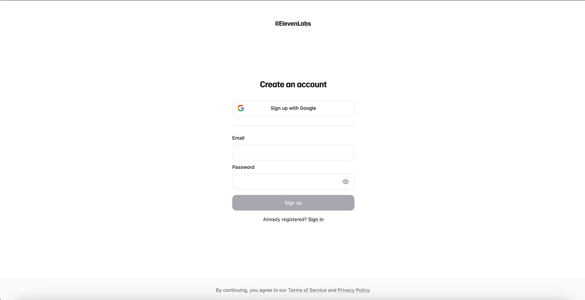

# 📋 Assignment: Assignment 1 - Center a Div

**Status:** 🔴 Not Started | 🟡 In Progress | ✅ Completed
**Course:** DevOps + WebDev
**Created:** 2026-01-23
**Deadline:** {{Deadline}}

---

- https://petal-estimate-4e9.notion.site/Assignment-1-Age-old-question-How-to-center-a-div-2ea7dfd1073580a1afced0569416309d



## 📖 Problem Statement

> Create Elleven Labs Login Page

## 💡 My Approach

- **Logic:**
- **Tech Stack:**
- **Challenges Faced:**

## 🏗️ Sandbox Environment

- **Location:** `./sandbox/`
- **Setup Instructions:**
  ```bash
  # Example
  npm install
  npm run dev
  ```

## 🏁 Checklist

- [ ] Requirements Met
- [ ] Tests Passed
- [ ] Code Cleaned/Linted
- [ ] Submitted

---

_Created via 100xDev Templates_
